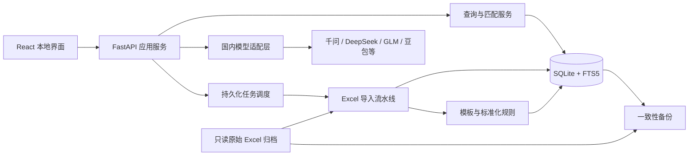
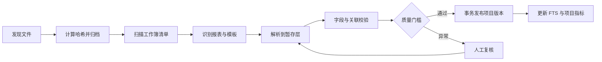

# AI 驱动的个人造价数据库：技术架构调研与选型

| 项目 | 内容 |
| --- | --- |
| 文档版本 | V0.1 |
| 调研日期 | 2026-07-25 |
| 文档状态 | 初步选型，待真实 Excel 样本验证 |
| 依据文档 | 产品需求文档 V0.1 |
| 当前约束 | 单人、本地运行；可调用国内云端大模型；暂不使用 Embedding |

## 1. 结论摘要

第一版建议采用“本地 Web 应用 + Python 模块化单体 + SQLite 单一事实源”的架构：

- 前端：React + TypeScript + Vite。
- 本地后端：Python + FastAPI + Pydantic。
- 业务数据库：SQLite + SQLAlchemy + Alembic。
- Excel 解析：openpyxl 为主，Polars 用于批量转换与校验，python-calamine 作为特殊格式或性能补充。
- 检索：结构化 SQL + SQLite FTS5 trigram + RapidFuzz + 领域规则评分。
- AI：国内云端大模型的厂商中立适配层，只处理必要数据片段；输出必须通过本地 Schema 校验。
- 后台任务：本地持久化任务表 + 单机工作进程，不引入 Redis、Celery 等服务。
- 文件存储：原始 Excel 只读归档，使用 SHA-256 去重；结构化记录保留文件、工作表和单元格坐标。
- 交付：后端同时提供 API 和前端静态文件，只监听 `127.0.0.1`；成熟后用 PyInstaller 打包并自动打开系统浏览器。
- 备份：SQLite Online Backup API + 原始文件增量备份 + 校验清单。

第一版明确不采用：

- Embedding 模型和向量数据库。
- PostgreSQL、Qdrant、Elasticsearch、Redis 等独立服务。
- DuckDB 作为业务主库。
- LangChain、LlamaIndex、Dify 等通用 AI 编排框架。
- Electron 或 Tauri 桌面壳。
- 微服务架构。

这套方案的核心取舍是：优先保证造价数据准确、可追溯、可备份和可维护，而不是优先追求复杂的 AI 技术栈。

## 2. 需求对架构的约束

技术选型必须同时满足以下条件：

1. 单人、本地使用，不要求服务器运维能力。
2. 约 380 个历史项目，单项目包含多份格式复杂的 Excel。
3. 原始数据不得被修改，导入结果必须可追溯到原始 Excel 位置。
4. 需要处理清单、定额、工料机、综合单价组成、措施费及项目指标之间的关系。
5. 价格和工程量计算不能使用普通浮点数造成不可解释的精度误差。
6. 大批量导入可能运行数分钟，页面不能因此失去响应。
7. AI 服务不可用时，查询、筛选、统计和已确认规则仍须正常工作。
8. 云端 AI 只接收必要数据片段，API 密钥不能暴露给浏览器。
9. 暂不使用 Embedding，匹配结果必须尽可能可解释。
10. 后续可能增加斯维尔、宏业和自制 Excel，但第一版优先广联达。

## 3. 调研发现

### 3.1 SQLite 适合第一版业务主库

SQLite 官方将桌面应用、财务分析工具、CAD 和记录管理工具列为典型应用场景，并建议设备本地、低写并发、低于 TB 级的数据优先使用 SQLite。当前产品是单人、本地应用，写操作可以由本地后端串行管理，与 SQLite 的边界高度吻合。

SQLite 的主要限制是同一数据库文件同一时刻只有一个写者。对于单人应用，这不是实质问题；导入和人工修改统一通过一个本地后端写入即可。

SQLite FTS5 自带 trigram tokenizer，能够执行通用子串匹配，适合中文清单描述、规格型号和简称搜索。它不等于中文语义搜索，但配合字段标准化和领域规则足以完成第一版候选召回。

备份不能在数据库运行时简单复制主文件。SQLite 官方 Online Backup API 可以生成一致性快照，并允许应用在备份期间继续使用数据库，因此应作为数据库备份的基础能力。

### 3.2 DuckDB 适合后续分析加速，不适合现在做主库

DuckDB 官方将自身定位为进程内分析型数据库。其单进程分析性能和列式执行很适合大型汇总、临时分析和 Parquet，但业务系统还需要频繁的小事务、版本状态、人工修正、任务状态和规则维护，SQLite 更自然。

DuckDB 当前多进程写入能力依赖仍处于 beta 阶段的 Quack 协议。其 VSS 向量扩展仍标注为实验性，官方同时警告持久化 HNSW 索引在异常关机时可能出现数据丢失或索引损坏，不建议生产使用。

结论：第一版不引入 DuckDB。若真实数据达到数百万至数千万行并出现复杂汇总瓶颈，可将 DuckDB 作为可重建的只读分析加速层，而不是事实源。

### 3.3 Excel 必须采用“两阶段读取”

openpyxl 能读取工作表、合并单元格、公式文本、缓存值及单元格坐标，适合需要保留 Excel 结构和数据血缘的场景。其只读模式采用延迟读取和近似恒定内存，适合大文件扫描。

需要注意：

- `data_only=False` 读取公式文本。
- `data_only=True` 读取 Excel 上次保存的缓存结果，并不会执行公式计算。
- 部分计价软件可能写入错误的工作表维度，不能盲信 `max_row` 和 `max_column`。
- 合并单元格的真实值通常只存在于左上角，需要在解析规则中显式处理。
- openpyxl 不应承担修改原始文件的职责。

因此推荐：

1. 第一阶段使用普通模式扫描工作簿结构、表名、表头指纹、合并区域、公式和有效范围。
2. 第二阶段根据已识别模板读取目标区域；大范围纯值数据可使用只读模式流式处理。
3. 公式文本与缓存结果需要分别读取并保留，不能通过一次打开工作簿同时获得两者。

Polars 用于批量清洗、类型转换、关联校验和统计；python-calamine 只作为 `.xls`、`.xlsb` 或超大文件快速取值的补充，因为快速取值不能替代 openpyxl 对工作簿结构的检查。

### 3.4 国内模型支持结构化输出，但不能直接信任

调研的国内平台普遍提供 JSON 模式或兼容接口。例如阿里云百炼的结构化输出文档覆盖千问、Kimi、DeepSeek、GLM 等模型；DeepSeek 也提供 JSON Output。

官方文档同时披露了重要边界：

- DeepSeek 的 JSON Output 仍有概率返回空内容。
- 部分思考模型即使开启 JSON 模式，也可能返回非严格 JSON。
- 不同模型、区域和版本支持的参数并不完全一致。

因此系统不能直接把某一厂商的 SDK 贯穿业务代码，也不能假设 JSON 模式等于 Schema 保证。正确做法是建立小型厂商适配层，并在本地执行 Pydantic 校验、错误分类、有限重试和人工确认。

### 3.5 第一版不需要向量数据库

造价数据匹配首先受以下硬条件约束：

- 清单或定额编码。
- 专业与成本类别。
- 计量单位及单位换算关系。
- 材质、强度、规格、厚度和施工方式。
- 项目地区、计价时间和成果阶段。
- 国内清单或港式清单等计价体系。

Embedding 容易把文字相似但计价口径不同的项目排在一起。第一版采用“规则召回、字段评分、人工确认”更可解释，也更容易建立准确的个人规则。

`sqlite-vec` 当前仍是 pre-v1；DuckDB VSS 持久化仍是实验功能；Qdrant 本地模式官方定位偏开发、原型和测试。既然当前不需要 Embedding，引入这些组件只会增加部署、同步和备份成本。

## 4. 推荐总体架构

架构形态为模块化单体。所有模块部署在同一个本地应用中，但通过清晰接口分隔，避免未来扩展时互相耦合。

## 5. 技术栈选型

| 层级 | 选择 | 理由 |
| --- | --- | --- |
| 前端 | React + TypeScript + Vite | 适合复杂表格、筛选和异步任务界面；生态成熟；静态产物可由本地后端直接提供 |
| 服务端 | Python + FastAPI | Python 的 Excel 和数据处理生态最合适；FastAPI 提供类型化 API 与自动文档，但不强迫复杂框架结构 |
| 数据校验 | Pydantic | 同一套 Schema 可用于 API、Excel 解析结果和大模型 JSON 输出校验 |
| ORM | SQLAlchemy 2 | 关系模型、事务边界和测试能力成熟，避免在业务层散落 SQL |
| 数据迁移 | Alembic | 显式管理数据库版本，确保未来升级和备份恢复可验证 |
| 主数据库 | SQLite | 零运维、单文件、事务可靠、适合单人本地应用 |
| 全文检索 | SQLite FTS5 trigram | 无额外服务，支持中文子串召回，与主数据保持事务一致 |
| 模糊匹配 | RapidFuzz | 本地、确定性、速度快，评分可解释 |
| Excel 结构读取 | openpyxl | 能检查合并单元格、公式、样式与坐标，满足血缘要求 |
| 批处理 | Polars | 严格类型、低内存、适合批量转换、关联和统计 |
| 特殊 Excel 补充 | python-calamine | 支持更多 Excel 格式且读取快，但不作为结构解析真源 |
| 后台任务 | SQLite 任务表 + 单机 worker | 可恢复、无 Redis、符合单机写入模型 |
| Excel 导出 | openpyxl | 生成带格式的参考价和质量报告，无需引入第二套导出引擎 |
| 测试 | pytest + Playwright | 分别覆盖解析/规则/数据一致性和完整用户流程 |
| Python 环境 | uv + 锁文件 | 安装和依赖解析速度快，确保开发及构建可重复 |
| 本地打包 | PyInstaller | 将 Python 服务打包为可执行应用；前端作为静态资源内置 |

版本策略：实施时锁定所有直接及间接依赖，不在本文件写死 2026-07-25 的最新版本。先以兼容 Python 3.13 的稳定版本组合做样本验证，再生成锁文件。

## 6. 后端模块边界

建议在一个代码库中划分以下业务模块：

1. `projects`：项目元数据、项目版本和状态。
2. `source_files`：原始文件、哈希、工作表清单和来源坐标。
3. `imports`：文件识别、模板路由、解析、校验和发布。
4. `cost_items`：清单、定额、综合单价组成、工料机及措施费。
5. `normalization`：标准名称、单位、规格、分类和用户规则。
6. `search`：结构化筛选、全文检索、候选排名和查询解释。
7. `metrics`：单方造价、钢筋含量和混凝土含量计算。
8. `ai_gateway`：国内模型适配、脱敏、Schema 校验、调用日志和预算控制。
9. `exports`：查询结果、匹配结果、质量报告和参考价 Excel 导出。
10. `backups`：数据库快照、文件清单、完整性校验和恢复。

模块之间通过业务服务调用，不拆分网络微服务。只有在未来出现多人、跨设备或任务需要独立扩容时才重新评估拆分。

## 7. 数据存储设计原则

### 7.1 单一事实源

SQLite 保存所有业务状态、结构化造价记录、导入版本、规则和审计记录。全文索引属于可重建索引，不是事实源。

原始 Excel 保存在受管理的本地文件目录，不放入数据库 BLOB。数据库只保存相对路径、文件哈希、大小、修改时间和来源信息。

### 7.2 原始层、暂存层和发布层

导入数据分为三层：

- 原始层：不可修改的 Excel 文件及工作簿清单。
- 暂存层：本次解析产生的候选记录、警告和关联结果，可重复生成。
- 发布层：通过质量门槛并经用户确认的项目版本，供查询和指标计算使用。

解析器不得直接写入正式业务表。只有完整导入批次通过事务发布，查询默认数据才会改变。

### 7.3 版本与修正

- 文件内容使用 SHA-256 识别，相同内容重复导入直接跳过。
- 文件变化形成新项目版本，旧版本不覆盖。
- 原始记录保持不可变。
- 用户修正保存为映射规则、覆盖层或新版本，不回写源数据。
- 每条发布记录包含 `project_version_id`、`source_file_id`、工作表和来源区域。

### 7.4 数值精度

金额、单价、费率、消耗量和工程量不能使用二进制浮点数作为业务真值。

推荐使用定点整数存储：

- 值以缩放后的 64 位整数保存。
- 字段同时定义固定缩放位数和单位。
- Python 中使用 `Decimal` 计算。
- 导出时按照原始或目标精度格式化。

对于总额、单价、费率和工程量应分别定义精度，不能默认所有字段都以“分”为最小单位。

### 7.5 单位体系

- 原始单位永远保留。
- 标准单位和换算结果单独保存。
- 换算规则包含来源、版本和有效状态。
- `m2`、`㎡` 等同义表达可自动标准化。
- `m3` 与 `100m3` 等比例单位只有规则明确时才能转换。
- 无法可靠换算时禁止合并价格。

## 8. Excel 导入架构

推荐流水线：

### 8.1 模板识别

识别顺序应为：

1. 文件哈希和已知模板命中。
2. 工作表名称、关键表头、列组合及标题指纹。
3. 用户已确认的模板规则。
4. 本地启发式评分。
5. 只有无法识别时，才把脱敏后的少量表头发送给大模型生成候选映射。

大模型不应参与每一行解析，避免成本、不稳定性和不必要的数据外发。

### 8.2 解析器插件

每类来源和报表建立独立解析器，例如“广联达清单计价表”和“广联达综合单价分析表”。解析器输出统一中间 Schema，后续校验与发布不依赖具体软件。

模板差异优先用声明式配置处理；当层级、跨行或关联逻辑确实复杂时再使用专用解析代码。不能把所有模板差异堆进一个巨大条件分支。

### 8.3 质量门槛

发布前至少执行：

- 必填字段、类型和单位校验。
- 清单与综合单价分析关联检查。
- 定额与工料机关联检查。
- 汇总金额和组成金额容差检查。
- 重复编码与重复来源检查。
- 空白行、合并单元格和小计行误识别检查。
- 来源坐标可解析性检查。
- 项目版本完整性检查。

任何无法确认的记录进入异常队列，不应静默丢弃。

## 9. 无 Embedding 的检索与匹配方案

### 9.1 候选召回

查询先进行标准化，再组合以下方式召回候选：

- 编码精确匹配和前缀匹配。
- 标准名称、原始名称、项目特征和规格的 FTS5 trigram 搜索。
- 个人同义词、简称和历史确认规则。
- 专业、单位、地区、计价体系、时间和成果阶段过滤。

### 9.2 硬性排除

以下情况默认不能作为同一价格样本：

- 单位不兼容且没有换算规则。
- 关键材质、强度或规格冲突。
- 国内清单和港式清单口径无法解释。
- 原始数据状态为作废。
- 用户明确设置了禁止匹配规则。

### 9.3 可解释评分

剩余候选按字段权重评分：

- 编码一致程度。
- 标准名称和原始描述的 RapidFuzz 分数。
- 规格关键字覆盖率。
- 单位一致性。
- 专业、地区、项目类型和计价阶段相似度。
- 时间距离。
- 用户历史确认或拒绝记录。

界面必须展示各项得分原因，而不是只显示一个黑盒总分。

### 9.4 大模型的有限作用

当规则无法区分前几名候选时，可将查询项和少量候选发送给国内大模型，让其输出：

- 是否可比。
- 关键相同点和不同点。
- 需要人工确认的问题。
- 建议排序及理由。

模型输出只影响建议，不直接改变硬性排除规则或正式数据。

### 9.5 自然语言查询

大模型不直接生成和执行 SQL。它只把自然语言转换为受控的 `SearchIntent`，例如地区、时间范围、专业、名称、规格和价格口径。后端校验该结构后，再使用参数化查询生成结果。

这样可以避免模型产生越权 SQL、错误表名或不可审计的查询逻辑。没有模型时，用户仍可使用结构化筛选完成相同查询。

## 10. 国内模型接入设计

第一版只定义厂商中立接口，不立即决定最终供应商或模型。

建议的内部能力接口只有：

1. `classify_report`：对未知报表给出类型候选。
2. `suggest_field_mapping`：对未知表头给出字段映射候选。
3. `parse_search_intent`：把自然语言转换为受控查询结构。
4. `compare_candidates`：解释少量匹配候选的异同。
5. `suggest_normalization`：提出名称、规格和分类标准化建议。

每个厂商适配器负责：

- 请求协议和鉴权。
- 模型与区域配置。
- JSON 模式差异。
- 超时、限流和错误分类。
- 内容截断及空响应处理。
- 用量与费用记录。

所有调用遵循：

1. 本地构造最小必要载荷。
2. 根据配置执行字段脱敏。
3. 记录发送字段范围、供应商、模型和提示词版本。
4. 接收结果后执行 Pydantic Schema 校验。
5. 失败时有限重试；仍失败则进入人工处理，不猜测结果。
6. AI 建议需要用户确认后才能形成长期规则。

暂不引入 LangChain、LlamaIndex 或 LiteLLM。第一版能力数量很少，直接适配更容易控制参数差异、数据外发和错误语义。若后续同时维护三家以上供应商，再评估统一网关。

## 11. 后台任务与并发

Excel 扫描、解析、质量校验、指标重算、导出和备份均作为后台任务运行。

第一版使用 SQLite 中的任务表持久化：

- 状态：等待、运行、等待复核、成功、失败、已取消。
- 保存进度、当前文件、错误摘要和重试次数。
- 应用异常退出后，运行中的任务标记为中断，可重新开始。
- 同一时刻只允许一个重型导入写任务，查询可并行读取。
- 任务步骤必须幂等，重试不能生成重复项目版本。

无需引入 Redis、Celery 或消息队列服务。Python 的 CPU 密集解析与 Web 请求应隔离到工作进程，避免阻塞 API 服务。

## 12. 前端架构

第一版是工作型工具，主要界面应围绕高密度表格和异常处理：

- 项目库与项目版本。
- 导入任务及质量报告。
- 清单、定额、工料机和综合单价明细。
- 多条件筛选和自然语言查询。
- 相似项比较与逐项确认。
- 项目指标和来源追溯。
- 规则管理、模型设置与备份恢复。

React Query 管理服务端状态、缓存和任务轮询；TanStack Table 管理列、排序、筛选和虚拟化。业务状态留在后端，不在浏览器维护第二份事实源。

前后端采用同源部署，FastAPI 提供 API 和构建后的静态页面。第一版不需要 Next.js 服务端渲染，也不需要 Electron/Tauri 的桌面窗口层。

## 13. 本地部署与安全

### 13.1 运行方式

- 应用只绑定 `127.0.0.1`，不监听局域网地址。
- 后端选择可用端口并打开系统浏览器。
- 前端与 API 同源，默认不开放 CORS。
- 对 `Host` 和 `Origin` 做校验，避免恶意网页调用本地 API。
- 文件操作只能访问用户明确选择或应用管理的数据目录。

### 13.2 密钥

- 国内模型 API Key 保存在操作系统钥匙串中。
- 浏览器端永远看不到 API Key。
- 日志和导出文件不得包含密钥。
- 开发环境可以通过环境变量注入，但 `.env` 不进入版本库。

### 13.3 AI 数据外发

- 默认发送结构化片段，不发送整份工作簿。
- 支持项目名称和客户信息脱敏。
- 保存调用元数据和载荷字段清单；是否保存完整载荷由用户配置。
- 供应商正式选型前必须单独审查服务协议、日志留存、训练使用和数据地域条款。

## 14. 备份与恢复

一次完整备份包含：

- SQLite 一致性快照。
- 原始 Excel 归档。
- 应用配置和用户规则。
- 文件清单、哈希和备份版本信息。

备份流程：

1. 使用 SQLite Online Backup API 生成数据库快照。
2. 增量复制新增或变化的原始文件。
3. 生成 SHA-256 校验清单。
4. 将备份写入临时目录。
5. 全部校验成功后原子性标记为完成。

恢复不能直接覆盖正在运行的数据库。应先在临时目录恢复并校验，再关闭业务连接完成切换。每个正式版本都必须进行一次自动化恢复演练。

## 15. 方案对比与取舍

| 候选方案 | 结论 | 原因 |
| --- | --- | --- |
| SQLite 主库 | 采用 | 单人本地、零运维、单文件、事务和备份成熟 |
| PostgreSQL 主库 | 暂不采用 | 功能强但需要服务安装、端口、升级和备份运维，当前收益不足 |
| DuckDB 主库 | 不采用 | 更偏分析型；业务状态和小事务不是其最佳定位 |
| DuckDB 分析层 | 延后 | 数据规模或复杂汇总出现实测瓶颈后再引入 |
| Elasticsearch / Meilisearch | 不采用 | 增加独立索引服务和同步问题，FTS5 足以验证第一版 |
| 向量数据库 | 不采用 | 当前明确不使用 Embedding，且会增加部署和一致性成本 |
| Python 后端 | 采用 | Excel、数据清洗和 AI API 生态更匹配 |
| Node.js 全栈 | 不采用 | UI 合适，但复杂 Excel 解析与数据处理不如 Python 直接 |
| 模块化单体 | 采用 | 一个用户、一个设备，部署和调试成本最低 |
| 微服务 | 不采用 | 没有独立扩容与团队边界，纯粹增加故障面 |
| 系统浏览器 | 采用 | 符合需求，避免桌面壳和 Python sidecar 打包复杂度 |
| Electron | 不采用 | 捆绑 Chromium，体积和内存成本没有必要 |
| Tauri | 延后 | 桌面体验好，但第一版会引入 Rust 壳与 Python sidecar 生命周期管理 |
| 通用 AI 编排框架 | 不采用 | 当前 AI 能力有限且需要严格可控，直接适配更清晰 |

## 16. 验证计划与决策门槛

技术选型必须用 5 至 10 个真实脱敏广联达项目验证，不能只靠文档推断。

### 16.1 样本要求

样本应覆盖：

- 不同广联达版本或导出模板。
- 土建、装饰、安装等不同专业。
- 正常表、合并表头、隐藏行列、公式和大文件。
- 清单计价、综合单价分析、工料机和措施费等主要报表。
- 至少一个港式清单内地项目。

### 16.2 初步技术指标

以下为进入正式开发前的建议门槛，样本审计后可调整：

- 原始文件重复导入：100% 幂等。
- 已发布记录来源可追溯率：100%。
- 关键金额和工程量解析正确率：不低于 99.5%。
- 清单与综合单价组成自动关联正确率：不低于 98%。
- 未能可靠识别的数据：100% 进入异常报告，不静默丢弃。
- 100 个已标注查询的前 5 个候选命中率：不低于 90%。
- 备份恢复后记录数、哈希、版本和来源关系：100% 一致。
- AI 服务关闭时：导入、筛选、统计、来源追溯和规则匹配仍可用。

### 16.3 需要通过实测再决定的事项

- 是否需要 Polars，还是 openpyxl + SQL 已足够。
- 是否需要 python-calamine 支持 `.xls` 或 `.xlsb`。
- FTS5 trigram 对真实中文清单描述的召回质量。
- SQLite 在真实最大项目和批量导入时的性能。
- 是否需要单独的工作进程，还是线程即可满足首批样本。
- PyInstaller 打包后的启动速度、体积和 FTS5 能力。
- 国内模型在造价字段映射和候选解释任务上的准确率与成本。

只有上述实测出现明确瓶颈，才增加 DuckDB、独立搜索服务或更复杂的任务系统。

## 17. 推荐实施顺序

### 阶段 0：数据审计

- 收集并脱敏 5 至 10 个代表性项目。
- 建立工作簿清单、模板差异表和关键字段字典。
- 确认面积、金额、工程量和单位精度。

### 阶段 1：导入技术验证

- 验证 openpyxl 对真实报表结构、公式和合并单元格的读取。
- 定义统一中间 Schema 和来源坐标格式。
- 验证幂等导入、暂存层、质量报告和事务发布。

### 阶段 2：数据库与检索验证

- 建立最小关系模型和 FTS5 索引。
- 用人工标注的查询集验证规则召回和 RapidFuzz 排名。
- 验证金额精度、单位换算和三项项目指标。

### 阶段 3：产品原型

- 实现项目导入、异常复核、查询、对比和来源追溯闭环。
- 暂不依赖云端 AI，先证明核心数据库可用。

### 阶段 4：国内模型接入

- 用固定评测集比较千问、DeepSeek、GLM、豆包等候选。
- 评估结构化输出成功率、造价术语理解、延迟、成本和数据条款。
- 只接入通过评测的一个默认供应商，同时保留适配接口。

### 阶段 5：打包与备份

- 打包为本地可执行应用。
- 完成密钥存储、备份恢复和升级迁移测试。

## 18. 风险与应对

| 风险 | 影响 | 应对 |
| --- | --- | --- |
| Excel 模板差异超出预期 | 导入规则膨胀 | 解析器插件化；先审计样本；未知模板必须复核 |
| 公式缓存为空或过期 | 金额不可信 | 同时读取公式与缓存值；做汇总校验；必要时要求用 Excel 重新保存 |
| 合并单元格和层级误判 | 记录错位 | 保留坐标和行类型；使用黄金样本回归测试 |
| SQLite 写锁 | 批量导入受阻 | 单写任务、短事务、分批暂存、发布时一次事务切换 |
| FTS5 中文召回不足 | 相似项漏检 | 同义词、字段拆解、RapidFuzz、用户规则；实测后再决定是否升级检索 |
| 大模型 JSON 不稳定 | 自动化中断 | Schema 校验、有限重试、降级为人工确认 |
| 模型供应商变化 | 集成失效 | 内部能力接口、适配器、固定评测集，不在业务层使用厂商响应对象 |
| 本地硬盘损坏 | 数据丢失 | 自动备份、异盘副本、哈希校验和定期恢复演练 |
| 打包后 SQLite 能力不同 | FTS5 不可用 | 在构建产物中执行启动自检和集成测试 |

## 19. 最终建议

可以确认的技术路线是：

> 先用 Python、FastAPI、SQLite、openpyxl 和 React 建立一个可追溯的本地造价数据系统；检索依赖结构化字段、FTS5、RapidFuzz 和用户规则；国内大模型通过小型适配层提供辅助理解，不参与事实存储，也不使用 Embedding。

当前最重要的下一步不是进一步增加框架，而是取得代表性的广联达 Excel 样本，完成数据审计和导入技术验证。Excel 结构、公式缓存和报表关联方式将决定数据模型细节，这是目前最大的技术不确定性。

## 20. 主要资料

### 官方文档

- [SQLite：Appropriate Uses For SQLite](https://www.sqlite.org/whentouse.html)
- [SQLite：FTS5 Extension](https://www.sqlite.org/fts5.html)
- [SQLite：Online Backup API](https://www.sqlite.org/backup.html)
- [DuckDB：Concurrency](https://duckdb.org/docs/current/connect/concurrency)
- [DuckDB：Vector Similarity Search Extension](https://duckdb.org/docs/current/core_extensions/vss.html)
- [openpyxl：Optimised Modes](https://openpyxl.readthedocs.io/en/stable/optimized.html)
- [openpyxl：Excel Reader API](https://openpyxl.readthedocs.io/en/stable/api/openpyxl.reader.excel.html)
- [DeepSeek：JSON Output](https://api-docs.deepseek.com/zh-cn/guides/json_mode)
- [阿里云百炼：结构化输出](https://help.aliyun.com/zh/model-studio/qwen-structured-output)

### GitHub 项目核查

- [FastAPI](https://github.com/fastapi/fastapi)
- [SQLAlchemy](https://github.com/sqlalchemy/sqlalchemy)
- [Alembic](https://github.com/sqlalchemy/alembic)
- [DuckDB](https://github.com/duckdb/duckdb)
- [sqlite-vec](https://github.com/asg017/sqlite-vec)
- [Qdrant](https://github.com/qdrant/qdrant)
- [LanceDB](https://github.com/lancedb/lancedb)
- [Polars](https://github.com/pola-rs/polars)
- [python-calamine](https://github.com/dimastbk/python-calamine)
- [RapidFuzz](https://github.com/rapidfuzz/RapidFuzz)
- [React](https://github.com/facebook/react)
- [Vite](https://github.com/vitejs/vite)
- [TanStack Query](https://github.com/TanStack/query)
- [TanStack Table](https://github.com/TanStack/table)
- [PyInstaller](https://github.com/pyinstaller/pyinstaller)

GitHub 活跃度仅用于判断维护状态和生态成熟度，不作为单独的选型依据。最终选型以产品约束、官方能力边界和真实样本测试为准。
